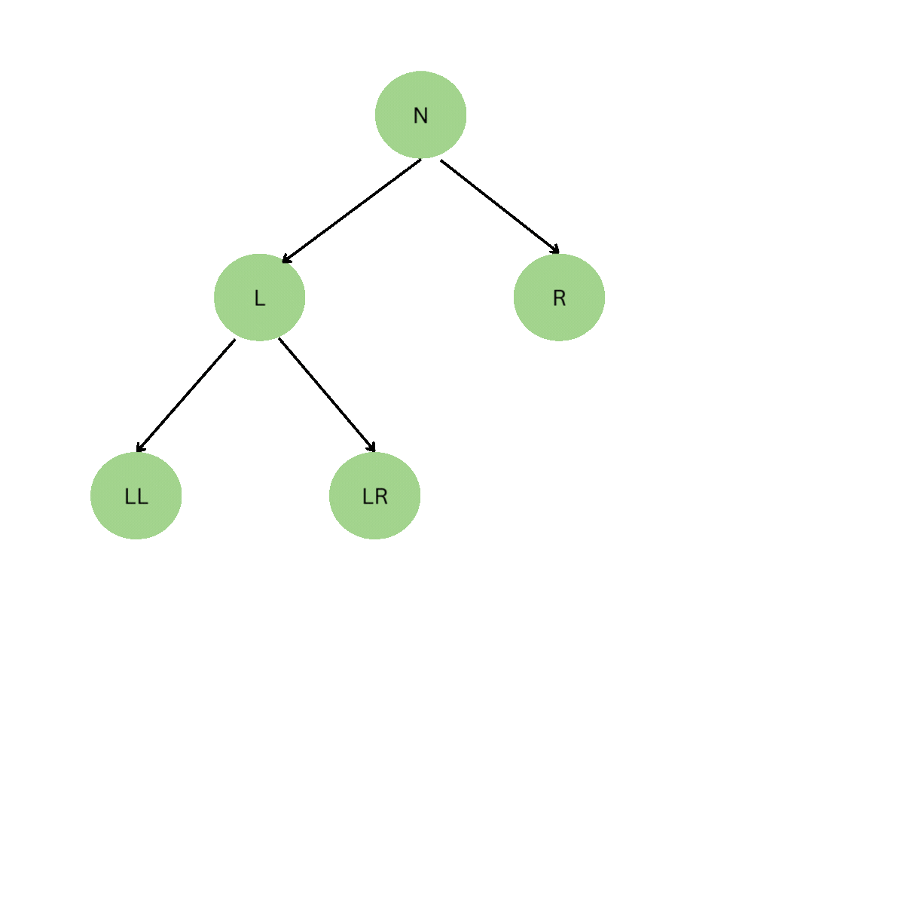
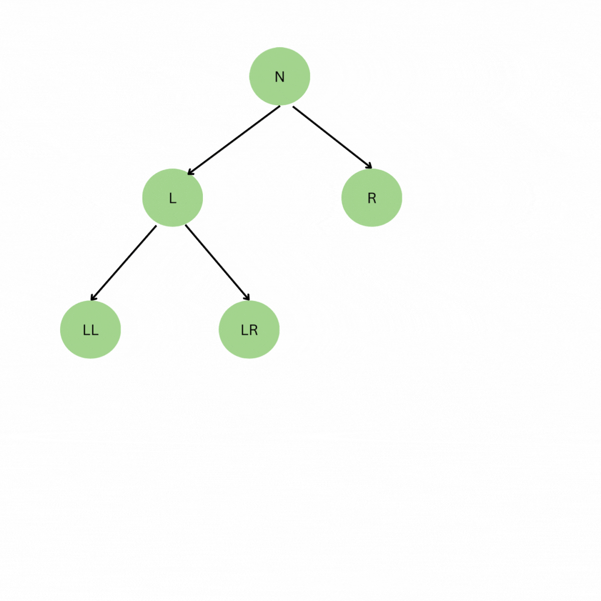
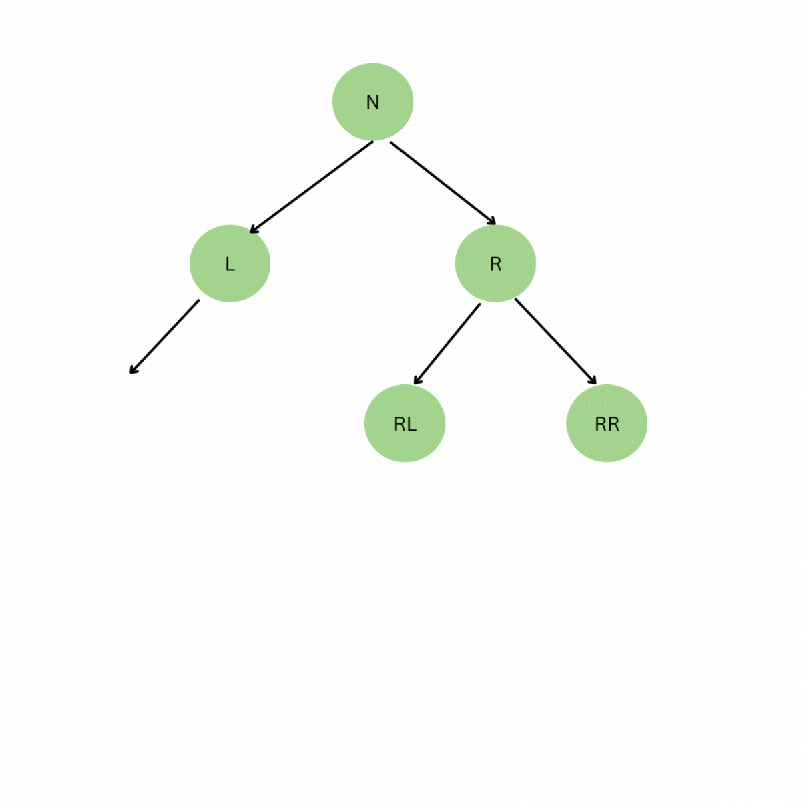
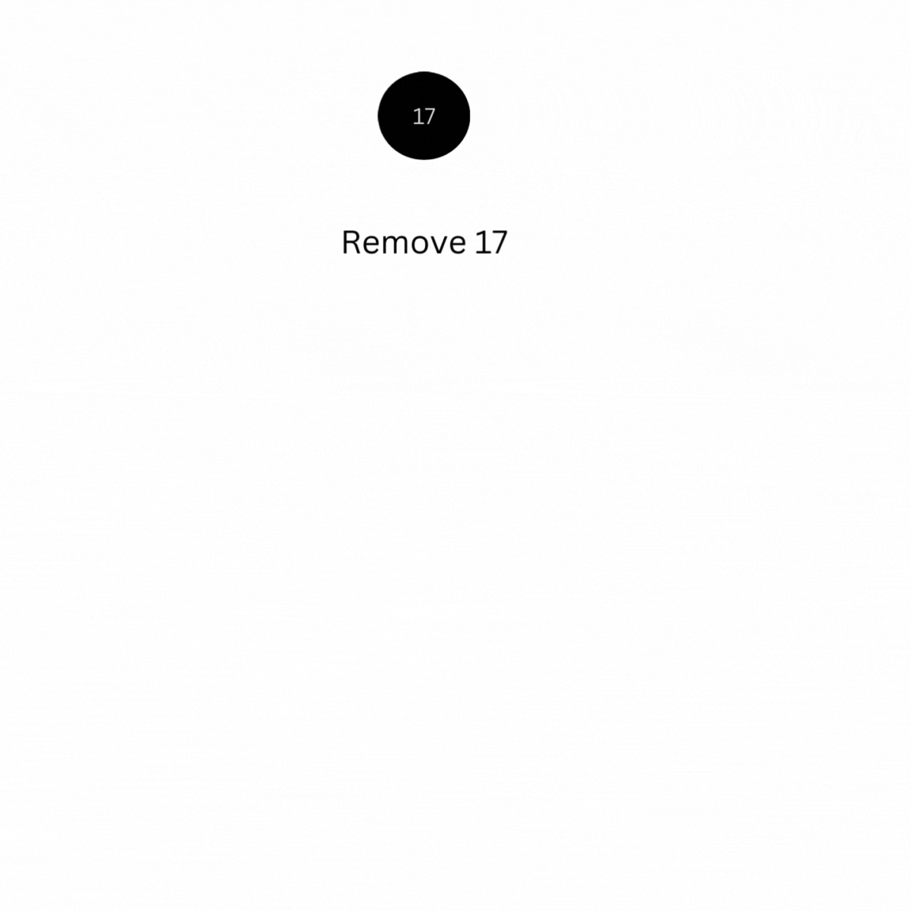
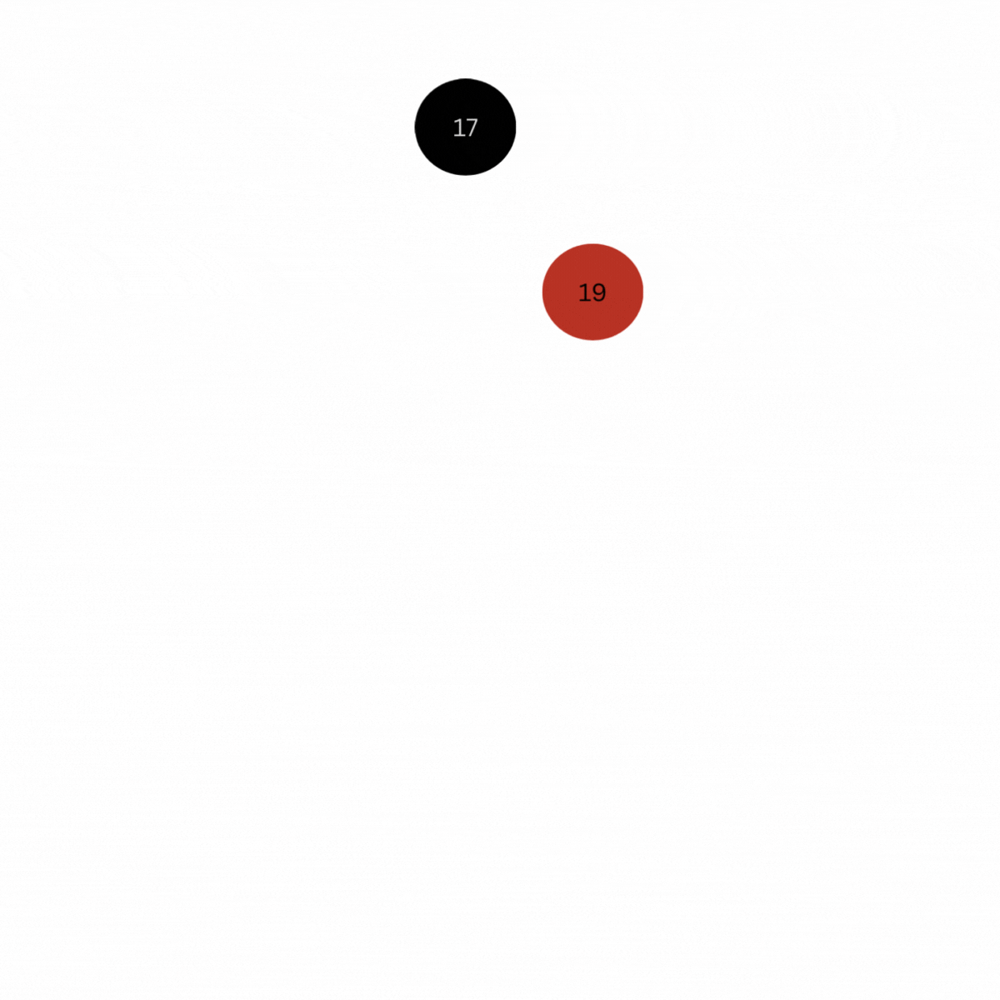
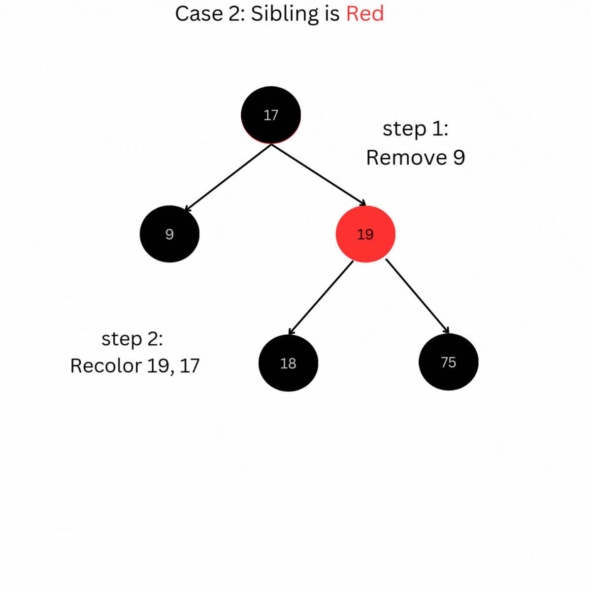

## Red-Black Tree properties:

### The following rules enforce the red-black tree balance:

- Each node is either red or black.
- (The root is black.)
- All NIL leaves are black.
- A red node must not have red children.
- All paths from a node to the leaves below contain the same number of black nodes.

Deletion: 

- If the node to be deleted has no children, we simply remove it.
- If the node to be deleted has one child, we remove the node and let its single child move up to its position.
- If the node to be deleted has two children, we copy the content (not the color!) of the in-order successor of the right child into the node to be deleted and then delete the in-order successor according to rule 1 or 2 (the in-order successor has at most one child by definition).

-  Right Rotation:
 <!--  -->

-  Left Rotation:

- Zero Child Deletion (case1)

- One Child Deletion (case1)

- Case 2 Deletion, Sibling is Red

https://www.canva.com/design/DAGRX0z6MZA/Pm49dV4s_hjUDs0RrOehNA/watch?utm_content=DAGRX0z6MZA&utm_campaign=share_your_design&utm_medium=link&utm_source=shareyourdesignpanel